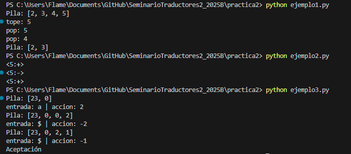

# Práctica 2 — Analizador Sintáctico LR(1) con Pila de Enteros

En esta práctica se implementa un **analizador sintáctico LR(1)** usando una pila de enteros.

## Contenido
- `ejercicios-lr1.xlsx` — incluye las tablas LR y trazas de:
  - Ejercicio 1: entrada `hola+mundo`
  - Ejercicio 2: entrada `a+b+c+d+e+f`
- `ejemplo1.cpp` — uso básico de la pila (push, top, pop).
- `ejemplo2.cpp` — lectura de símbolos con el analizador léxico.
- `ejemplo3.cpp` — primera tabla LR con reducciones.

## Convenciones
- `acción > 0` → **shift** (desplazamiento).
- `acción < 0` → **reduce** (−1 = aceptación).
- `acción = 0` → **error**.

## Notas
- Se utilizan los mismos índices de tokens que en la práctica 1.
- Esta práctica prepara el terreno para la migración a objetos (Práctica 3).

