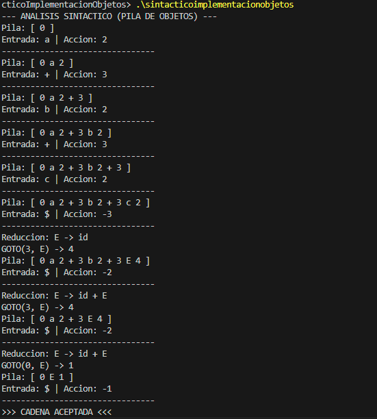

# Práctica 3: Analizador Sintáctico LR(1) con Pila de Objetos

**Estudiante:** Daniel Gaitan
**Código:** 219294005
**Materia:** Seminario de Solución de Problemas de Traductores de Lenguajes II
**Lenguaje:** C++

---

## 1. Introducción y Diferencias con la Práctica Anterior

El objetivo principal de esta práctica es evolucionar la implementación del Analizador Sintáctico LR(1).

### ¿Por qué cambiar la implementación?
En la **Práctica 2**, la pila se implementó utilizando un arreglo sencillo de enteros (`vector<int>`). Aunque funcional, presentaba problemas serios de **semántica y depuración**:
* La pila contenía valores mixtos (Tokens y Estados) representados únicamente por números.
* Al imprimir la pila (ej. `[0, 2, 4]`), era difícil distinguir si el `2` representaba al token `$` o al Estado 2.

### La Solución: Orientación a Objetos
En esta **Práctica 3**, se sustituye la pila de enteros por una **Pila de Objetos** utilizando Polimorfismo. Ahora, cada elemento en la pila es una instancia de una clase específica que se "conoce a sí misma".

---

## 2. Arquitectura del Sistema

Se implementó una jerarquía de clases para manejar los diferentes tipos de elementos que pueden convivir en la pila:

### Diagrama de Clases (Concepto)
* **Clase Base Abstracta:** `ElementoPila` (Define el contrato `mostrar()`).
    * **Hijo 1:** `Estado` (Almacena el ID del estado, ej: `0`, `1`).
    * **Hijo 2:** `Terminal` (Almacena el lexema del token, ej: `"id"`, `"+"`).
    * **Hijo 3:** `NoTerminal` (Almacena el símbolo gramatical, ej: `"E"`).

### Implementación Técnica (C++)
```cpp
// Uso de métodos virtuales para lograr Polimorfismo
class ElementoPila {
public:
    virtual void mostrar() = 0; 
};
```

## 3. Pruebas y Resultados

Para la validación del sistema se utilizó la gramática del **Ejercicio 2**:

$$E \to id + E \mid id$$

### Traza de Ejecución
A continuación se muestra la ejecución del análisis para la cadena de entrada `a+b+c`. 



**Observación:** Gracias a la implementación de objetos, la pila ahora muestra información mixta y legible. Se puede apreciar claramente la distinción entre un **Estado** (ej. `0`, `2`) y un **Símbolo Terminal** (ej. `a`, `+`) conviviendo dentro de la misma estructura de datos, algo que era imposible de visualizar con la pila de enteros anterior.

---

## 4. Conclusión

La implementación mediante **Objetos y Polimorfismo** añade una capa de abstracción necesaria para este tipo de problemas. 

Aunque el cambio implica una mayor complejidad técnica en el código fuente (gestión de punteros, herencia y clases virtuales), el resultado final ofrece ventajas significativas:
* **Legibilidad:** Facilita la comprensión del estado interno del analizador (la pila se explica sola).
* **Escalabilidad:** Permite agregar nuevos tipos de símbolos gramaticales sin romper la estructura de la pila.
* **Robustez:** El uso de tipos fuertes evita errores lógicos comunes al mezclar enteros que representan cosas distintas.