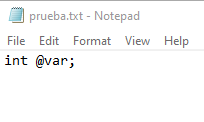
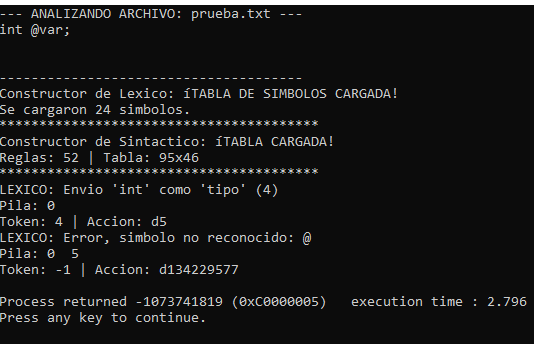
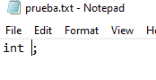
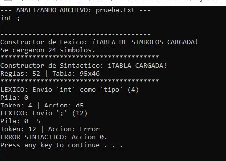
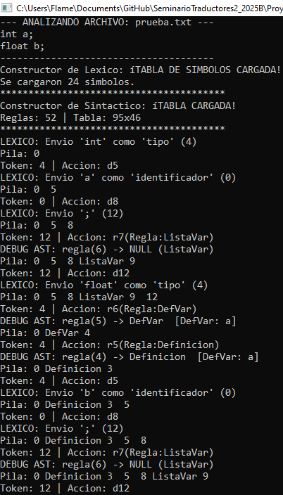
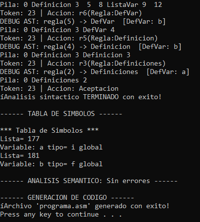

# Reporte de Avance: Analizador Léxico y Sintáctico

**Estudiante:** Daniel Gaitan
**Código:** 219294005
**Materia:** Seminario de Solución de Problemas de Traductores de Lenguajes II
**Fase:** Construcción del Traductor II

---

## 1. Objetivo del Componente
El objetivo de esta fase es integrar el módulo léxico (Scanner) con el motor sintáctico (Parser) para procesar archivos de código fuente externos. El sistema debe ser capaz de transformar una secuencia de caracteres crudos en una estructura jerárquica válida, detectando errores en el proceso.

---

## 2. Diseño de la Implementación

### 2.1. Lectura de Archivo Fuente
El compilador recibe como entrada un archivo de texto plano (ej. `fuente.txt`). Utilizando flujos de entrada (`ifstream`), el sistema carga el contenido y lo entrega al analizador léxico carácter por carácter, permitiendo la compilación de cualquier código sin recompilar el analizador.

### 2.2. Arquitectura del Analizador Léxico
El analizador léxico funciona como una **máquina de estados finitos**.
* **Proceso:** Agrupa caracteres en lexemas válidos.
* **Salida:** Genera tokens con su ID correspondiente a la tabla LR (ej. `0` para identificadores, `4` para tipos de dato).

### 2.3. Arquitectura del Analizador Sintáctico
Se implementó un analizador **LR(1)** guiado por tabla.
* **Pila de Análisis:** Almacena objetos mixtos (Estados y Símbolos) usando polimorfismo.
* **Interacción:** Solicita tokens al Lexer y decide entre **Desplazamiento (Shift)** o **Reducción (Reduce)** según la Tabla LR cargada.

---

## 3. Manejo de Errores

El sistema implementa estrategias de detección y reporte:

1.  **Errores Léxicos:**
    Se detectan caracteres que no pertenecen al alfabeto del lenguaje (ej. `@`, `?`). El Lexer reporta la línea y el carácter inválido.

    


    


2.  **Errores Sintácticos:**
    Se detectan cuando la combinación `[Estado Actual, Token Entrante]` corresponde a una acción inválida (celda vacía) en la Tabla LR. El sistema detiene el análisis para evitar la construcción de un árbol corrupto.
    
    


    

    
---

## 4. Pruebas de Ejecución (Caso Exitoso)

Se sometió al traductor a un archivo de prueba válido (`fuente.txt`) con declaración de variables.

**Código Fuente:**
```cpp
int a;
float b;
```

# Evidencia: 
Se observa la comunicación correcta: el Lexico envía tokens y el Sintáctico realiza reducciones (r6, r5) construyendo el Árbol Sintáctico.





# 5. Pruebas de Manejo de Errores (Caso Fallido)
Para cumplir con los requerimientos de robustez, se probó el sistema con un código inválido para verificar el reporte de errores.

Prueba de Error: Se introdujo un carácter inválido (@) o una sintaxis rota para forzar el fallo.

Salida del Sistema: Como se muestra a continuación, el compilador detecta la anomalía, imprime un mensaje descriptivo del error y detiene el proceso de manera controlada.


