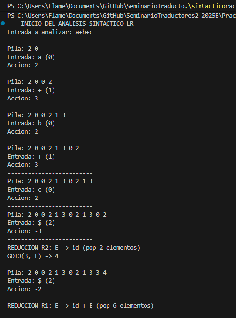

# Práctica: Analizador Sintáctico LR(1) - Implementación

**Estudiante:** Daniel Gaitan
**Código:** 219294005
**Materia:** Seminario de Solución de Problemas de Traductores de Lenguajes II

---

## Descripción
Esta práctica consiste en la implementación de un **Analizador Sintáctico LR(1)** utilizando una Pila (Stack) y una Tabla de Análisis Sintáctico (Parsing Table) predefinida. El objetivo es validar cadenas de entrada bajo una gramática recursiva.

El programa resuelve el **Ejercicio 2** planteado en la documentación de la práctica.

### Gramática Utilizada
$$E \to id + E \mid id$$

### Componentes del Sistema

1.  **Clase Pila:**
    Implementación personalizada basada en vectores que permite las operaciones `push`, `pop` y `muestra` (para visualizar el estado de la pila en cada paso del análisis).

2.  **Clase Léxico:**
    Un tokenizador simplificado que mapea los caracteres de entrada a las columnas de la tabla LR:
    * `id` (letras) → Columna 0
    * `+` → Columna 1
    * `$` (fin de cadena) → Columna 2
    * `E` (No Terminal) → Columna 3

3.  **Algoritmo LR (Main):**
    Ciclo principal que consulta la tabla `tablaLR[estado][token]`.
    * **Acción > 0 (Desplazamiento/Shift):** Introduce el token y el nuevo estado a la pila.
    * **Acción < 0 (Reducción/Reduce):**
        * `-1`: **Aceptación** de la cadena.
        * `-2`: Aplica regla $E \to id + E$. Retira 6 elementos de la pila.
        * `-3`: Aplica regla $E \to id$. Retira 2 elementos de la pila.
    * Tras una reducción, se consulta la tabla GOTO para determinar el siguiente estado basado en el No Terminal `E`.

## Evidencia de Ejecución
Se analizó la cadena de entrada: `a+b+c`.
A continuación se muestra la traza de la pila y las acciones tomadas hasta la aceptación:

---

#Trabajo de clase en excel para comprender como se va moviendo la pila entre sus estados

