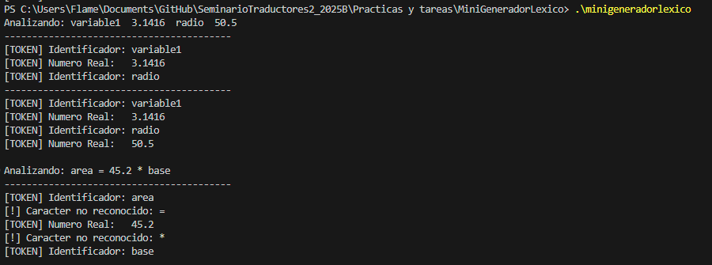

# Reporte Técnico: Mini Generador Léxico

**Estudiante:** Daniel Gaitan  
**Código:** 219294005  
**Materia:** Seminario de Solución de Problemas de Traductores de Lenguajes II  
**Lenguaje utilizado:** C++

---

## 1. Descripción del Problema
El objetivo de esta práctica fue desarrollar un analizador léxico simplificado (Mini Scanner) capaz de leer una cadena de entrada y reconocer dos tipos específicos de tokens basándose en reglas gramaticales estrictas.

### Reglas Implementadas:
1.  **Identificadores:** Deben comenzar con una letra, seguida de cero o más letras o dígitos.
    * *Expresión Regular:* `letra(letra|digito)*`
2.  **Números Reales:** Deben consistir en una parte entera, un punto decimal obligatorio y una parte fraccionaria.
    * *Expresión Regular:* `entero.entero+`

Cualquier otro carácter que no cumpla con estas reglas (como operadores o signos de puntuación no solicitados) es reportado como "no reconocido" o ignorado según el alcance de la tarea.

---

## 2. Implementación Técnica
El programa fue escrito en **C++** utilizando la librería estándar. No se utilizaron herramientas de generación automática (como Lex o Flex) para demostrar la lógica algorítmica subyacente.

### Lógica del Algoritmo:
El analizador recorre la cadena de entrada carácter por carácter:
1.  **Ignora** los espacios en blanco.
2.  **Detecta Identificadores:** Si encuentra una letra (`isalpha`), inicia un ciclo `while` que consume caracteres mientras sean alfanuméricos.
3.  **Detecta Reales:** Si encuentra un dígito (`isdigit`), inicia un ciclo que busca más dígitos y **un único** punto decimal.
    * *Validación:* Se verifica que el número contenga el punto decimal para ser clasificado como `Real`. Si no tiene punto, se reporta como Entero (o error según la estrictez).
4.  **Manejo de Errores:** Si el carácter actual no coincide con el inicio de un ID o un Número, se marca como desconocido y se avanza el puntero.

---

## 3. Pruebas y Resultados

Se realizaron pruebas con cadenas que mezclan identificadores, números reales válidos y caracteres no solicitados para verificar la robustez del analizador.

**Entradas de prueba:**
1.  `"variable1  3.1416  radio  50.5"`
2.  `"area = 45.2 * base"`

**Evidencia de Ejecución:**
A continuación se muestra la salida de la consola donde se observa la correcta tokenización de los elementos solicitados:

*Nota: Los caracteres '=' y '*' son marcados como "no reconocidos" correctamente, ya que no forman parte de la especificación de tokens solicitada para esta tarea.*

---

## 4. Enlace al Repositorio
El código fuente completo y este reporte se encuentran alojados en el siguiente repositorio:

https://github.com/DanielGaitan1/SeminarioTraductores2_2025B/tree/main/Practicas%20y%20tareas/MiniGeneradorLexico

---

