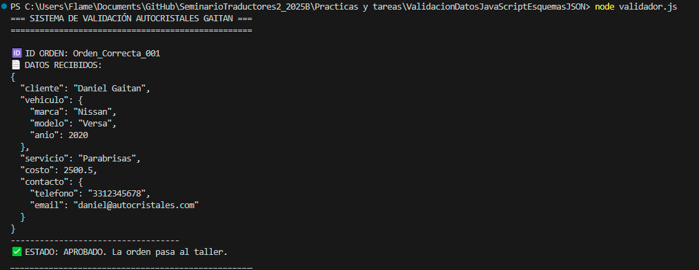
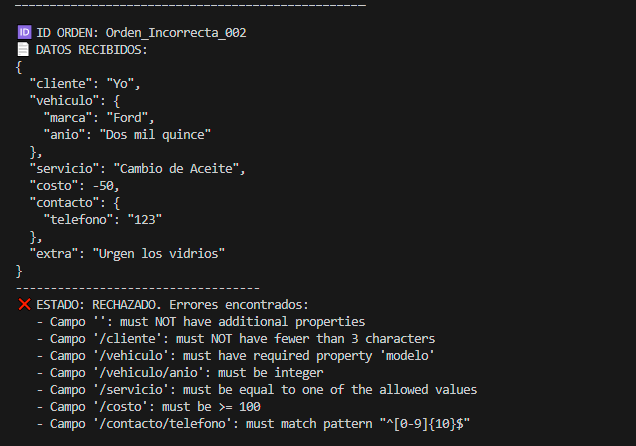
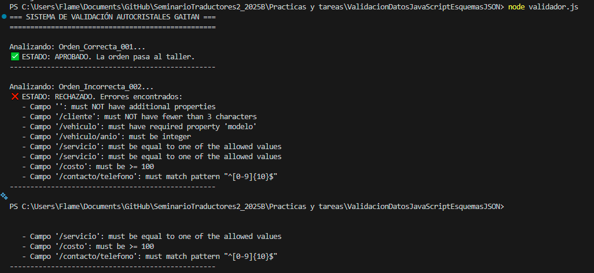
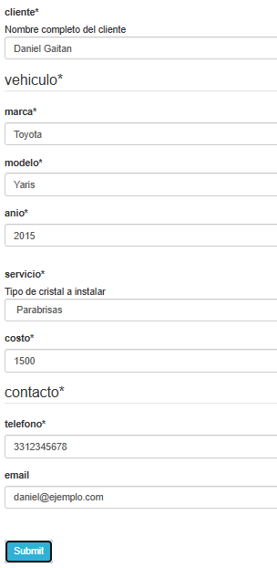

# Validación de Datos con JSON Schema y Node.js
**Proyecto:** Sistema de Validación de Órdenes - Autocristales Gaitán
**Estudiante:** Daniel Gaitan
**Código:** 219294005
**Materia:** Seminario de Solución de Problemas de Traductores de Lenguajes II
**Tecnología:** Node.js + Ajv

---

## 1. Descripción del Problema
En la operación diaria del taller "Autocristales Gaitán", la recepción de vehículos suele estar sujeta a errores humanos al capturar las órdenes de servicio. Es común encontrar registros con:
* Precios negativos o incoherentes.
* Números de teléfono incompletos.
* Años de vehículos fuera de rango (ej. "2050" o texto en lugar de número).
* Servicios inexistentes (ej. "Cambio de aceite" en un taller de cristales).

El objetivo de este proyecto es implementar un **Módulo de Validación Estricta** que actúe como filtro de calidad antes de que los datos sean procesados por el sistema administrativo.

---

## 2. Solución Implementada
Se desarrolló un script de validación ("Traductor de Reglas") utilizando **Node.js** y la librería estándar **Ajv (Another JSON Schema Validator)**.

El sistema desacopla la lógica en tres componentes:
1.  **Reglas (`schema.json`):** Definición declarativa de la estructura válida.
2.  **Datos (`datos.json`):** Lote de órdenes de prueba (casos de éxito y error).
3.  **Motor (`validador.js`):** Script que interpreta el esquema y audita los datos.

### Reglas de Negocio Definidas
El esquema JSON impone las siguientes restricciones estrictas:
* **Vehículo:**
    * `Marca` y `Modelo` son obligatorios.
    * `Año` debe ser un entero entre **1950 y 2026**.
* **Servicio:**
    * Solo se permiten valores de la lista cerrada: `"Parabrisas"`, `"Medallon"`, `"Aleta"`, `"Lateral"`, `"Quemacocos"`.
* **Contacto:**
    * `Teléfono`: Debe cumplir con el patrón `^[0-9]{10}$` (exactamente 10 dígitos).
    * `Email`: Debe tener estructura válida de correo (Regex estándar).
* **Costo:**
    * Debe ser numérico y mayor o igual a $100.00.

---

## 3. Pruebas de Ejecución (Backend)

Se ejecutó el validador procesando un lote de órdenes simuladas.
* **Caso 1 (Orden Correcta):** Cumple todas las reglas y es aprobada.


* **Caso 2 (Orden Incorrecta):** Contiene múltiples fallos intencionales para probar la robustez del validador.



### Evidencia de Consola
Como se observa en la siguiente captura, el sistema rechaza la orden incorrecta y lista puntualmente cada violación al esquema (tipo de dato incorrecto, campo faltante, patrón no coincidente):



---

## 4. Visualización del Formulario (Prototipo Frontend)
Una de las grandes ventajas de utilizar el estándar **JSON Schema** es la capacidad de generar interfaces de usuario automáticamente.

Utilizando la misma definición de reglas (`schema.json`) creada para el backend, se renderizó un prototipo de formulario web utilizando la tecnología *React JSON Schema Form*. Esto demuestra que el mismo código sirve para validar en el servidor y para construir la interfaz visual.

**Interfaz Generada Automáticamente:**


*(Captura generada mediante RJSF Playground)*

---

## 5. Conclusión
Este proyecto demuestra cómo la validación basada en esquemas (Schema-based validation) es superior a la validación tradicional imperativa (`if/else`).

* **Mantenibilidad:** Si las reglas del negocio cambian (ej. aceptamos autos desde 1940), solo se edita el archivo JSON, sin tocar el código fuente.
* **Interoperabilidad:** El mismo archivo JSON sirve para validar en el Backend (Node.js) y generar formularios en el Frontend (React/HTML).
* **Seguridad:** Se garantiza la integridad de los datos antes de que lleguen a la base de datos.

---

## 6. Instrucciones de Instalación
Para ejecutar este proyecto en local:

1.  **Requisitos:** Tener instalado Node.js (v18 o superior).
2.  **Instalar dependencias:**
    ```bash
    npm install ajv
    ```
3.  **Ejecutar el validador:**
    ```bash
    node validador.js
    ```